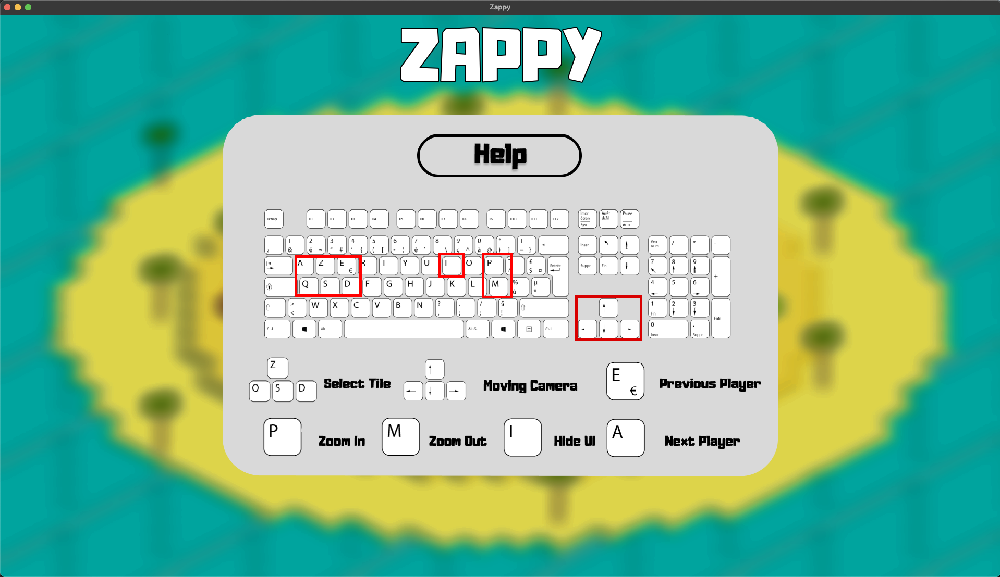
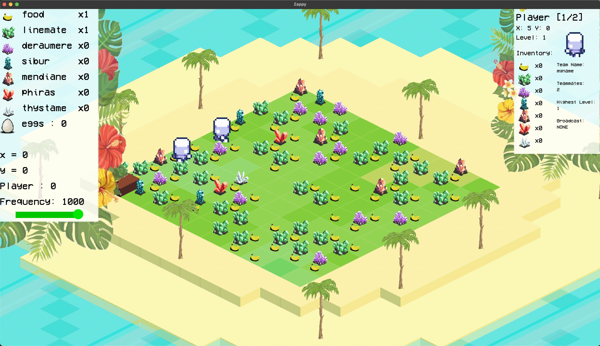
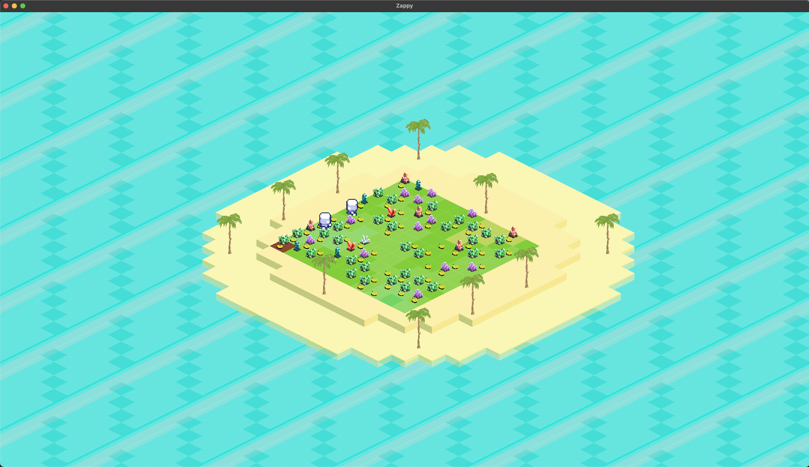
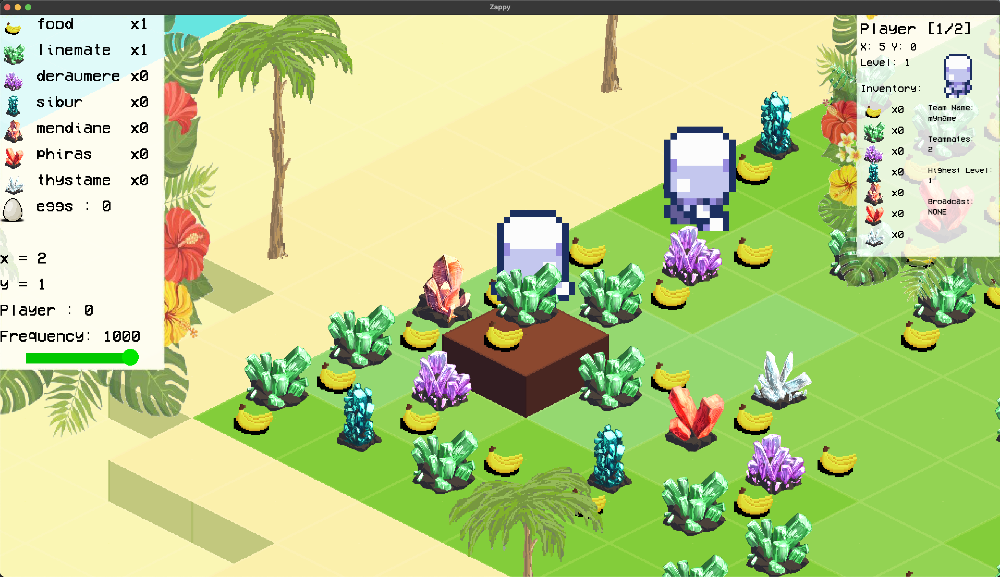
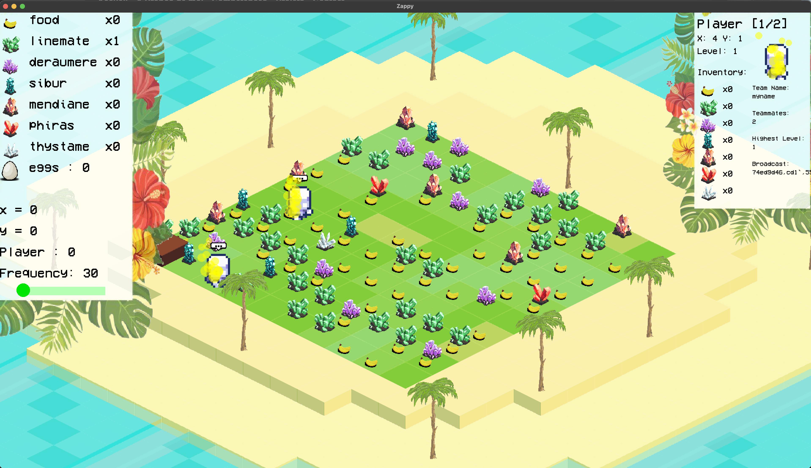
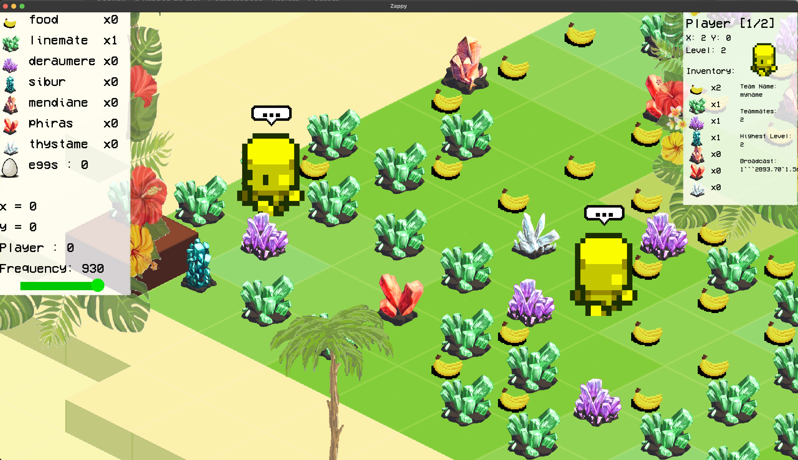
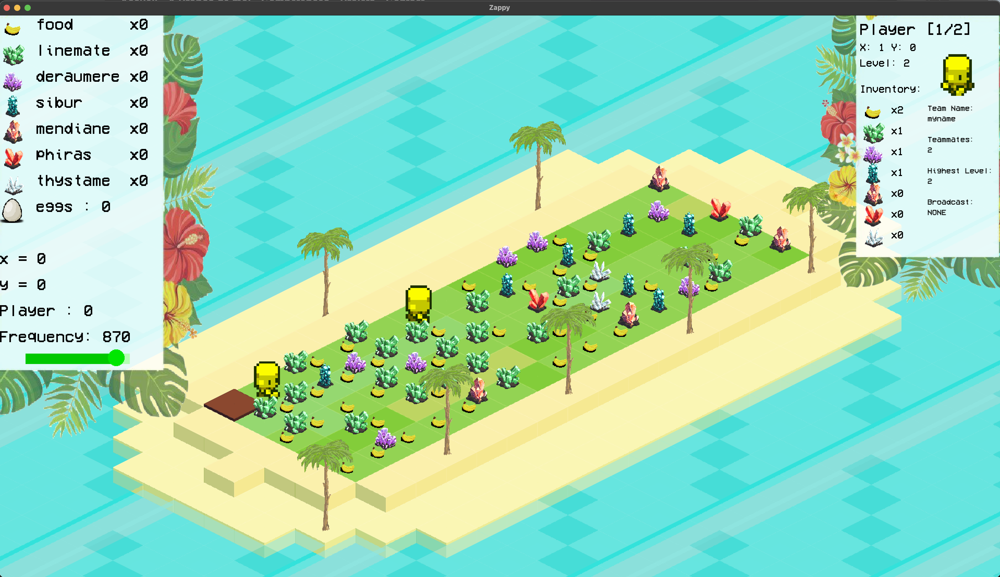
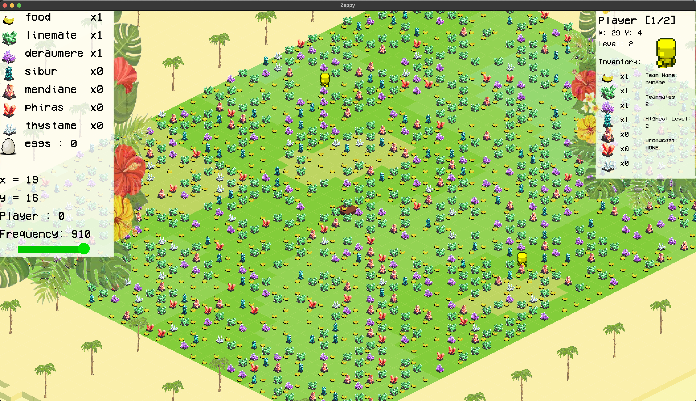
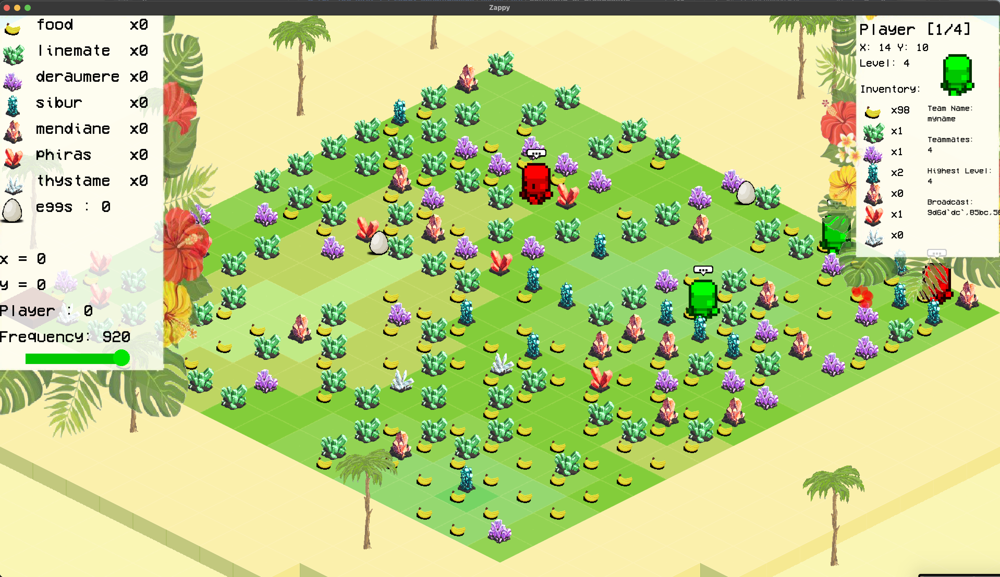

# Zappy Project

## Overview

Zappy is a multiplayer network game where teams compete on a tile-based world called Trantor. Players (AI-controlled drones) must collect resources, perform rituals to elevate their levels, and be the first team to have 6 players reach the maximum level (8). The project consists of three main components:

- **Server** (C): Manages the game world, resources, and player interactions
- **GUI** (C++/SFML): Provides an isometric visualization of the game world
- **AI Client** (Python): Controls player behavior and decision-making

## Features

- **Procedural Island Generation**: Beach-themed islands with Perlin noise for natural terrain
- **Isometric Visualization**: Beautiful 2.5D view of the game world
- **Resource Management**: Collect food (bananas) and minerals (colorful stones)
- **Elevation System**: Rituals requiring specific resources and player coordination
- **Team Competition**: Multiple AI teams competing for dominance
- **Real-time Network Game**: TCP-based communication between components

## Screenshots

### GUI Main Interface

*The main game interface showing the isometric view of Trantor with beach, palm trees, and resources*

### GUI Help

*Help menu showing controls and game information*

### 10x10 Map with 2 AI

*Compact 10x10 map with two AI players exploring*

### Island Overview

*Complete island view showing the spherical world boundaries*

### Zoomed In View

*Close-up view showing detailed terrain and resources*

### AI Evolution

*Player evolving with yellow particle effects indicating level progression*

### Broadcast Communication

*AI players communicating with speech bubbles*

### Small Island (5x15)

*Narrow 5x15 island layout*

### Large Island (25x45)

*Expansive 25x45 island world*

### High Level Players

*Level 3 and 4 players with eggs visible on the terrain*

## Technical Implementation

### Server (C)
```c
// Server architecture explanation
- Single process, single thread design
- poll() for socket multiplexing
- Real-time game state management
- Resource spawning algorithm
- Elevation ritual validation
```

### Graphical Client (C++/SFML)
```cpp
// GUI implementation details
- Isometric rendering engine
- Perlin noise terrain generation
- Beach island theme with palm trees
- Resource visualization (bananas, stones)
- Real-time network synchronization
```

### AI Client (Python)
```python
# AI decision making
- Finite state machine for player behavior
- Resource collection strategies
- Elevation planning and coordination
- Pathfinding and exploration algorithms
- Team communication protocols
```

## Installation & Usage

### Prerequisites
- C compiler (gcc)
- C++ compiler with SFML 2.x support
- Python 3.x
- Make

For MacOS users, install SFML 2.x via Homebrew:
```bash
brew install sfml@2

# Set library path
export LIBRARY_PATH=/opt/homebrew/Cellar/sfml@2/2.xxx/lib/
```

### Building
```bash
make zappy_server    # Build server
make zappy_gui       # Build graphical client
make zappy_ai        # Build AI client (Python script)
```

### Running

#### Server
```bash
# Help for server
./zappy_server -h
Usage: ./zappy_server -p port -x width -y height -n name1 name2 ... -c clientsNb -f freq
	port		is the port number
	width		is the width of the world
	height		is the height of the world
	nameX		is the name of the team X
	clientsNb	is the number of authorized clients per team
	freq		is the reciprocal of time unit for execution of actions
```

```bash
# Start server with example parameters
./zappy_server -p 4242 -x 20 -y 20 -n Team1 Team2 -c 3 -f 100
```

#### GUI

```bash
# Help for GUI
USAGE: ./zappy_gui -p port -h machine
	port	is the port number
	machine	is the name of the machine; localhost by default
```

```bash
# Start GUI
./zappy_gui -p 4242 -h localhost
```


#### AI Client

```bash
# Help for AI client
USAGE: ./zappy_ai -p port -n name -h machine
	port	is the port number
	name	is the name of the team
	machine	is the name of the machine; localhost by default
```

```bash
# Start AI client
./zappy_ai -p 4242 -n Team1 -h localhost
```

## Game Elements

- **Players**: Small robot drones with color-coded levels (white→yellow→red→green→...)
- **Resources**: Food (bananas) and 6 mineral types (colorful stones)
- **Terrain**: Beach, grass, water with natural transitions
- **Elevation**: Color particles during level-up rituals
- **Communication**: Speech bubbles for broadcasts

## Team
*Epitech Project - B-YEP-400 - Promotion 2026*
> Server developed by Kenan Blasius  
> GUI and AI developed by Niels Ouvrard

- [**Kenan Blasius**](https://github.com/Kenan-Blasius)
- [**Niels Ouvrard**](https://github.com/NielsOuvrard)
